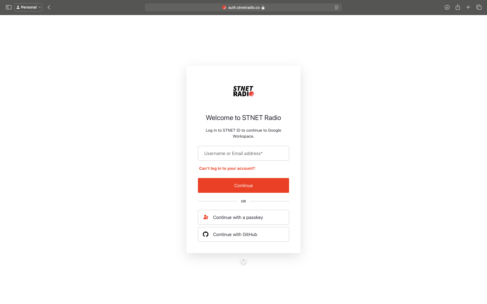
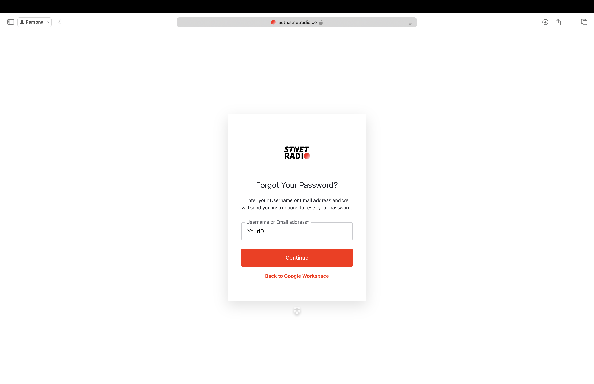
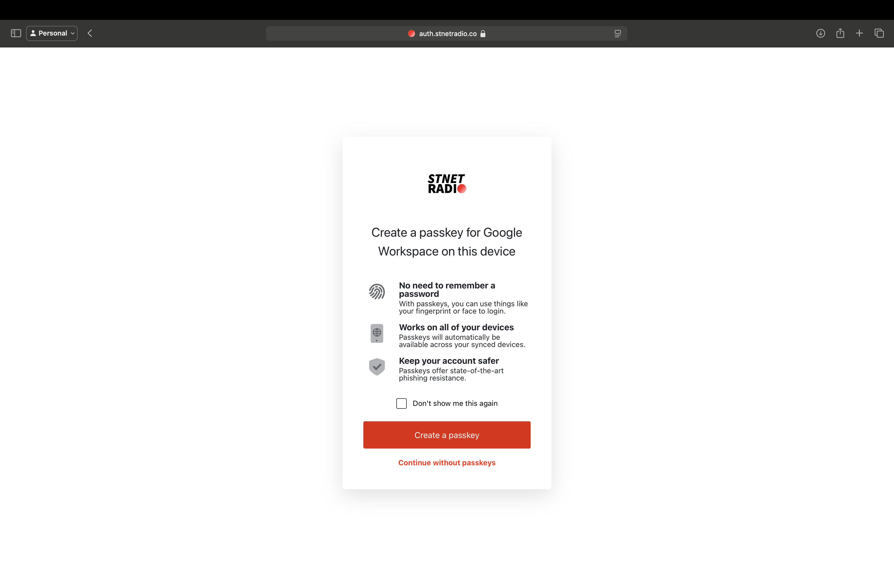

# What is STNET ID? And How to Access It

It is a Single Sign-On (SSO) system for accessing various services conveniently under one login. We call this system "STNET ID." Read the additional announcement [here](/stnetid/movetostnetid.md).

## What is STNET ID?

STNET ID is a system that employees and affiliates can use to update personal information and access related services. The purpose of this system is to facilitate and enhance the security of login procedures. You can log in at [id.stnetradio.co](https://id.stnetradio.co) (for stnetradio.co domain or STNET Radio employees only, it is not available yet; please wait for further announcements).

---

## How to Access for Employees

Steps to access email for the first time for employees who just started using STNET ID.

### First-time Login (For Employees Who Received Accounts After October 15, 2024)

For employees who wish to access the supported services, the first-time login steps are available [here](/stnetid/service.md).

1. Go to the website [id.stnetradio.co](https://id.stnetradio.co).
2. Enter the email address ending with @stnetradio.co, @team.stnetradio.co.
3. Choose to continue, then enter your password. Your first password is your date of birth (Gregorian calendar). For example, if you were born on January 1, 1990, your password would be 1January1990 (the first letter of the month is capitalized).
4. Register the passkey system [if you encounter issues, fix them here](#undefined-6).
5. Once logged in, select "Edit Information" and then change your password by following the steps.
6. Done! You can now log in to the supported services.

### How to Create a New Password for First-time Login (For Employees Who Received Accounts Before October 20, 2024)

For services requiring STNET ID, you can create a new password with the following steps:

1. Log in to Google Accounts using the company email (you will be automatically logged out after the first usage day).
2. After entering the email, click "Next."
3. You will be redirected to 'auth.stnetradio.co'. Don’t worry, just follow the next steps.
   
   
   
4. Enter your email or username, then click "Continue."
5. Select "Forgot Password" and follow the instructions to create a new password.
   
   
   
6. Enter the 6-digit confirmation code sent to your email.
7. Create and confirm a new password.

After successful registration, you will be redirected to the passkey registration page. Follow the instructions to register, confirming on another device (if using an office device). Once successful, you will be redirected to Google's page. If not, check the solution [here](#undefined-6).

---

## Troubleshooting

### If the Passkey Registration Page Does Not Appear After Password Creation

If the passkey registration page does not appear but the password change is successful, follow these steps:

1. Return to the Google Account login page.
2. Enter your email and click "Next."
3. Enter your email or username.
4. Enter the newly created password and click "Continue."
5. You will be able to create a new passkey. Please proceed by confirming on another device (if using an office device).

   - If you choose not to create a passkey, you can still use the account, but when logging in again, you will not be able to use Face ID, Touch ID, or any physical identifiers to log in. You will need to enter a password to log in.
   - If you are unable to log in due to incorrect email, username, or password, please ensure the information is correct. If the email or username is correct, select "Forgot Password" and follow the steps again.

Once the passkey registration is complete, you will be redirected to Google's page. If not, check the solution [here](#undefined-6).

### What to Do If No Information Is Found After Entering Email or Username

If you encounter this issue, you will need to contact us to resolve the issue immediately. Contact us at [team@stnetradio.co](mailto:team@stnetradio.co).

### What to Do If After Registering the Passkey It Returns to the Registration Page Again?

If you face this issue, you can fix it by following these steps:

1. Close the passkey registration page and open the login page again (go to Google.com and select "Sign In").
2. Enter the employee's email and click "Next."
3. When you reach 'auth.stnetradio.co', proceed with the passkey.
4. If the option to continue with the passkey does not appear, select the option to log in with email or username, then your device will show the passkey login option.
5. If your device does not show the passkey login option, you can check the supported devices [here](/stnetid/passkeysupported.md).

If you encounter registration issues or have further questions, contact us at: [team@stnetradio.co](mailto:team@stnetradio.co).